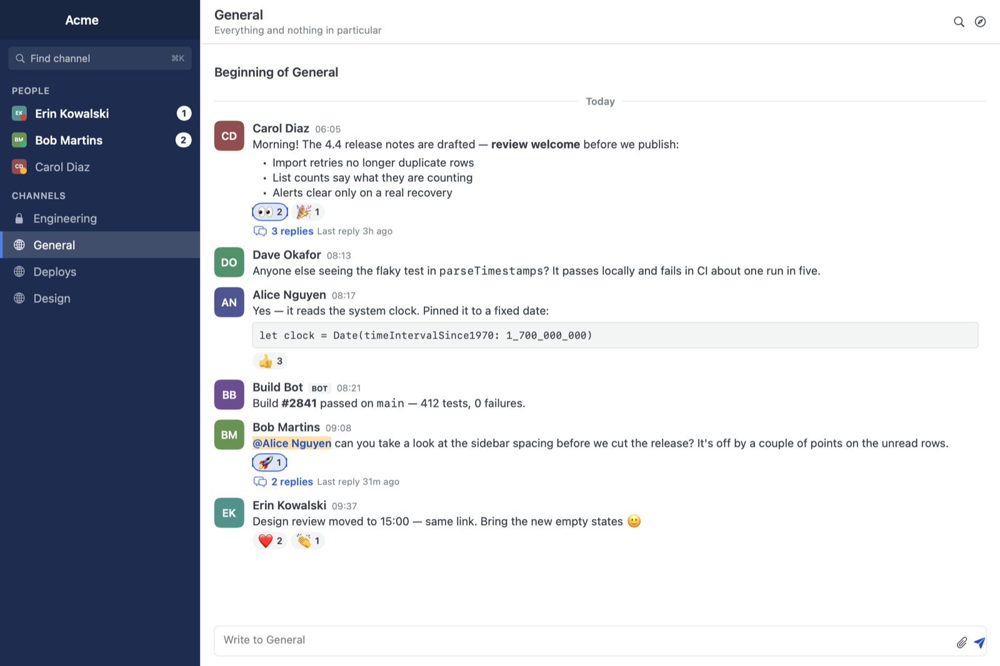

# MatterMemory

A lean, native macOS client for Mattermost. Same shape as the official
[Mattermost Desktop](https://github.com/mattermost/desktop) app, but built with AppKit +
SwiftUI on the system WebKit instead of Electron, with an explicit memory policy inspired by
[matterhorn](https://github.com/matterhorn-chat/matterhorn).

**~90 MB instead of ~800 MB.** Same server, same Mac, same account:

| | Electron Mattermost 6.3 | MatterMemory |
|---|---|---|
| Memory | ~800 MB, 16 processes | **~90 MB, 3 processes** |
| App bundle | ~300 MB (bundled Chromium + Node) | **3.8 MB** |
| Dependencies | hundreds of npm packages | **none** |



## Install

No pre-built release yet — build it yourself, it takes under a minute.

**Requirements:** macOS 13 or later, and the Xcode command line tools
(`xcode-select --install` if you don't have them).

```sh
git clone https://github.com/stevermeister/mattermemory.git
cd mattermemory
make run              # build, then launch
```

That produces `build/MatterMemory.app` and opens it. To keep it around:

```sh
make install          # copy into /Applications
```

The app is ad-hoc signed rather than notarized, so the very first launch of a copy in
`/Applications` may need **right-click → Open** once. macOS will also ask to allow
notifications.

**Start it at login:** Preferences (⌘,) → Startup → *Open MatterMemory at login*. It
registers with macOS through `SMAppService`, so it also shows up in System Settings →
General → Login Items, and you can turn it off from either place. At login it comes up
quietly in the menu bar with no window; click the menu bar or Dock icon to open it.
Uncheck *start in the background* if you would rather see the window at login.

Register the login item from the copy you actually keep — `/Applications`, not `build/`.

Other targets: `make app` (build without launching), `make debug` (fast debug build),
`make measure` (compare footprint against a running Electron Mattermost), `make clean`.

Launching with `MM_DEMO=1` opens the app on fabricated content with no network access —
handy for working on the UI offline, and how the screenshot above is produced.

## First run

1. The app asks for your server URL — `https://chat.example.com` or whatever your team uses.
2. Log in. Four ways, all equivalent afterwards:
   - **Username and password** right in the native login screen.
   - **SSO / SAML / OAuth** — click *Log in with SSO / in the web view*, finish the flow in
     the embedded web view, and the native view picks the session up automatically.
   - **Personal access token** — paste it into the *Token* field of the Add Server sheet.
   - **Environment** — export `MATTERMOST_URL` and `MATTERMOST_ACCESS_TOKEN` before launching
     for scripted setups.
3. That's it. Servers are remembered in
   `~/Library/Application Support/MatterMemory/servers.json` (names and URLs only; the
   session token lives in WebKit's cookie store and is never written there by the app).

Add more servers with ⌘N. With a single server the tab bar hides itself.

## Two modes per server

Switch at any time with ⌘⇧W, or right-click the server tab.

- **Native view (default)** — a SwiftUI client on Mattermost's REST + WebSocket API.
  No JavaScript, no DOM, no WebKit content process. ~90 MB.
- **Web view** — the real Mattermost web app in a WKWebView, for plugins, Calls, settings
  and anything the native view doesn't cover. ~370 MB while loaded, and it unloads itself
  when you stop looking at it.

Both share one session, so switching doesn't ask you to log in again.

## Keyboard

| | |
|---|---|
| ⌘K | Find channel or person |
| ⌘F | Search messages |
| ⌥↑ / ⌥↓ | Previous / next channel |
| ⌥⇧↑ / ⌥⇧↓ | Previous / next unread channel |
| Esc | Close thread, search, finder; cancel edit |
| ↩ / ⇧↩ | Send / new line |
| ↑ in empty box | Edit your last message |
| `+:emoji:` | React to the last message |
| `/command` | Run a slash command on the server |
| ⌘1…⌘9, ⌃Tab | Switch server |
| ⌘⇧W | Toggle web view for the current server |
| ⌘N | Add server |
| ⌘/ | Show this list in the app |

## Preferences (⌘,)

- **Native view** — compact sidebar (people and channels, unread first, then active in the
  last 3 hours) or the web app's full category list
- **Memory** — unload background servers after N idle minutes (default 20); unload everything
  while the window is closed for N minutes (default 10); low memory mode for web views
  (WebKit lockdown mode, default on); unload on memory pressure; poll unread counts for
  unloaded servers; memory readout in the top bar
- **Menu bar** — status icon with a mention badge and server list; optional menu-bar-only mode
  with no Dock icon
- **Notifications** — desktop notifications, unread dot on the Dock icon
- **Advanced** — Web Inspector

Right-click a server tab for Reload, Unload, Edit, reorder and Remove.

## Native view: what it does and doesn't

Does: teams, compact sidebar (people and channels; unread and mentioned first, then those active in the last 3 hours; the web
app's categories are available in Preferences) with unread bold and mention badges, muted channels, collapsed reply threads, message list with markdown (headings, lists,
code, quotes, tables, links, @mentions, emoji, custom emoji), bot/webhook attachments, image
thumbnails with preview, file download, reactions (quick bar + picker), threads panel, edit
(↑ on empty composer) / delete own posts, file upload (button, drag-drop, paste), search
(`from:` `in:` supported by the server), ⌘K switcher including people and joinable channels,
typing indicators, presence dots, native notifications for mentions/DMs respecting channel and
user notification settings, dock/tab badges, "New Messages" line.

Doesn't (use the web view for these): plugins (Calls, Playbooks, Boards, AI), link previews,
channel/user settings, profile editing, custom themes, slash commands, pinned/saved posts,
channel members list, message formatting toolbar, GIF picker, drafts sync.

## Why it uses less memory

| | Electron Mattermost 6.3 | MatterMemory |
|---|---|---|
| Runtime | Bundled Chromium + Node (≈300 MB on disk) | System WebKit (3.8 MB app bundle) |
| Per server | WebContentsView always loaded, always connected | WKWebView created on first click, torn down after N idle minutes |
| Background servers | Full page + websocket each | One 1-minute REST poll for unread counts (uses the existing session cookie) |
| Memory pressure | — | macOS pressure event → inactive servers unloaded |
| Extra processes | Renderer per view, GPU, network, utility, crashpad… | WebContent per *loaded* server, shared GPU + Networking |
| Renderer/main process | Node + React UI for the chrome itself | Native AppKit, ~30 MB |

Measured on the same Mac against the same self-hosted server (~140 channel memberships,
logged in), physical footprint summed over the app and its helper processes (what Activity
Monitor shows for the app group):

| State | Electron Mattermost 6.3 | MatterMemory |
|---|---|---|
| One server, native view (default) | ~800 MB (16 processes) | ~90 MB (3 processes) |
| One server, web view, low memory mode (default) | | ~370 MB (6 processes) |
| One server, web view, low memory mode off | | ~565 MB |
| Web view unloaded (idle / window closed) | — | ~50 MB |

Where the savings come from:

1. **Native view.** The REST/WebSocket client keeps a few MB of model state per server and
   renders with SwiftUI; there is no JavaScript bundle, no DOM, no WebContent process.
2. **No Chromium + Node** even in web mode: the system WebKit is already resident; the app is 3.8 MB.
3. **Low memory mode** (Preferences → Memory) puts web-view pages in WebKit's lockdown mode:
   no JavaScript JIT, no WebAssembly. ~150 MB less per web view, no visible difference.
4. **Web views you are not looking at cost nothing.** Created on first click, torn down after
   20 idle minutes or when the window has been closed for 10 minutes. Native sessions stay
   connected (they are cheap) so badges and notifications keep flowing for every server.
5. **Memory pressure** from macOS unloads inactive web views immediately.

## What was kept (web view)

- Multiple servers, server tabs with mention count / unread dot, ⌘1…⌘9, ⌃Tab
- Persistent login (WebKit's default data store), SSO/OAuth redirects and popups
- Native notifications with click-through to the channel/thread (the web app's own
  `Notification` calls are shimmed to `UNUserNotificationCenter`)
- Dock badge (mention count, or a dot for unread channels)
- Menu bar icon with mention badge and a server menu; optional menu-bar-only mode (no Dock icon)
- Downloads straight to `~/Downloads` with a notification that reveals the file
- File uploads, JS dialogs, camera/microphone for Calls (best effort), full screen
- Back/forward, reload, zoom, find, spell check, emoji picker, Web Inspector toggle
- `mattermost://` deep links, external links open in the default browser
- Closing the window keeps the app running (like the original)

## What was cut

Auto-updater, in-app downloads dropdown, Calls widget window and
screen-share picker, loading screen, URL preview bar, certificate/permission managers,
diagnostics/performance monitor, Sentry, i18n for the chrome, GPO/managed config,
Kerberos/NTLM helpers, multiple windows/popouts, Boards/Playbooks tabs (they live inside
the web app anyway), developer mode UI.

## Architecture

```
Sources/MatterMemory
├── Native/API        MMClient (REST), MMWebSocket, MMModels
├── Native/Store      ServerSession: bootstrap, websocket events, unread bookkeeping, notifications; ImageCache
├── Native/Markdown   MessageRenderer (blocks + inline AttributedString), Emoji table
├── Native/UI         SwiftUI: NativeRootView, SidebarView, ChannelView (list, composer), PostRow, Panels (thread, search)
├── main.swift, AppDelegate.swift        app lifecycle, menu actions, deep links, dock badge
├── Models/Server.swift, Settings.swift  JSON server store, UserDefaults settings
├── Web/ServerWebView.swift              one server: lazy WKWebView, title→unread parsing,
│                                        navigation policy, downloads, popups, dialogs
├── Web/WebViewManager.swift             per-server mode (native/web), active server, unloading, polling
├── Web/UnreadPoller.swift               GET /api/v4/users/me/teams/unread with WebKit's cookies
├── Web/Scripts.swift                    injected Notification shim
├── Views/ServerTabBar.swift             hand-drawn tab bar (Mattermost "Denim" colours)
├── Views/MainWindowController.swift     window with hidden title bar, tab bar + content
├── Preferences/                         preferences window, add/edit server sheet
├── Notifications/NotificationManager    UNUserNotificationCenter bridge
└── Util/MemoryStats.swift               app + WebKit helper footprint (Activity Monitor style)
```

How unread state works: the web app is loaded with a plain Safari user agent, so it
behaves like it does in a browser and writes `(3) * channel - team Site` into
`document.title`. The app observes the title and derives mention count and unread flag
from it; no Electron preload API needs to be emulated.

## Privacy and security

- **No telemetry.** The app talks to your Mattermost server and nothing else: no analytics,
  no crash reporting, no update check.
- **Credentials.** The session token lives only in WebKit's cookie store for the server's
  domain. The app never writes it to disk itself. `~/Library/Application Support/MatterMemory/servers.json`
  holds names and URLs only.
- **App Transport Security** is relaxed (`NSAllowsArbitraryLoads`) so `http://` and
  self-signed self-hosted servers work. Prefer `https://` servers.
- **Debug hooks** (below) are off unless you set `MM_SNAPSHOT` in the environment yourself;
  when set, they let a local file drive JavaScript in the page. Don't set it in normal use.
- The app is ad-hoc signed, not notarized. Build it yourself if you'd rather not trust a binary.

## Debugging aids

Set `MM_SNAPSHOT=/path/out.png` when launching, then:

- `kill -USR1 <pid>` writes a composite PNG of the window (works without screen-recording rights)
- `kill -USR2 <pid>` evaluates `/path/out.png.js` in the active page and writes the result plus
  window/notification state to `/path/out.png.out`; a file starting with `//native:unloadCurrent`
  (or `unloadInactive`, `reloadCurrent`, `activate N`) drives the memory policy and reports footprints.

## Known limitations

- Message search runs on the server; on database-backed (non-Elasticsearch) servers broad terms can
  take 30 s and come back empty. The app waits up to two minutes and says so when that happens.
- Unloaded servers do not receive real-time pushes; the poller notices new mentions within a minute.
  It honours Collapsed Reply Threads (root-post counters) so its numbers match the web app.
- Calls: audio/video permission is granted for the server origin, but screen sharing is not implemented.
- Ad-hoc signed: first launch may need right-click → Open. Notifications require allowing the app in System Settings.

## Contributing

Issues and pull requests welcome. The one rule that shapes the codebase: **keep it cheap**.
Anything that keeps a server's page or session alive when you're not looking at it, or that
pulls in a dependency, works against the point of the project. There are no third-party
packages and the goal is to keep it that way.

## License

MIT — see [LICENSE](LICENSE).

Not affiliated with, endorsed by, or sponsored by Mattermost, Inc. "Mattermost" is a
trademark of Mattermost, Inc. This is an independent client that speaks the public
Mattermost API.
